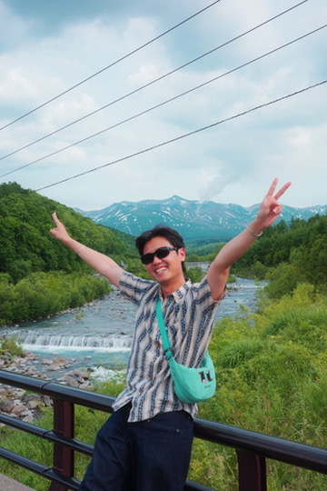

{width=250px}

Hi! My name is Wei. I'm from Taiwan and have lived in Vancouver for about 10 years. I'm currently a student in the Master of Data Science and Computational Linguistics program at UBC. Before joining the program, I worked in health research for five years as a researcher and AI developer, implementing LLMs into research workflows. After the program, I hope to apply what I learn to continue on a similar career path, in a more advanced role with more depth and responsibility.