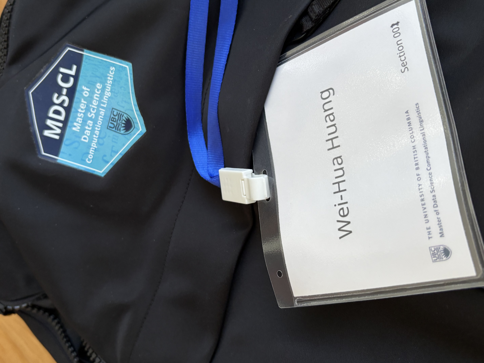

The first week in MDS was really fun! After working for five years, it was exciting to go back to the classroom and learn. The pace is fast, so I was a bit nervous the first two days, but once I got a better understanding of the structure, things started to feel pretty smooth. I'm excited for what comes next!

{width=250px}